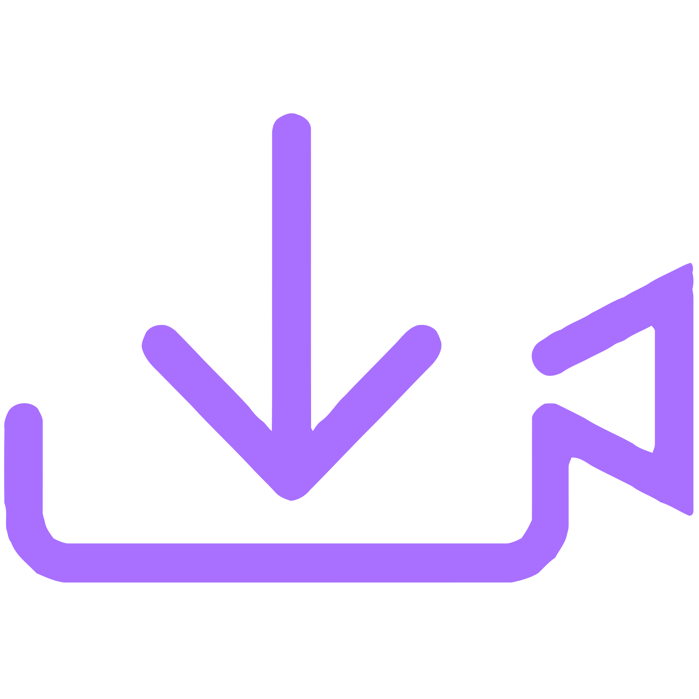
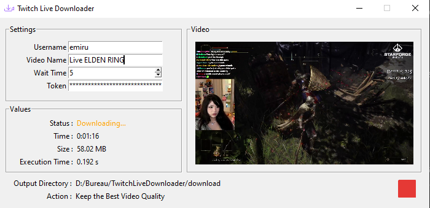

    

 

  
  
  

<h4 align="center">Download Twitch Lives in live</h4>

  <a href="#description">Description</a> •
  <a href="#installation">Installation</a> •
  <a href="#setting">Setting</a> •
  <a href="#functioning">Functioning</a>

 
 

## Description

This interface allows you to download live streams from the Twitch platform in live. This program therefore allows you to download live broadcasts which are not rebroadcast.

## Installation

For this script to work, you must have Python in version 3.9 *(or a higher version)* and have installed the following libraries:

| Name | Installation command |
| ------ | ------ |
| Fake Useragent | `pip install fake-useragent` |
| OpenCV | `pip install opencv-python` |
| Requests | `pip install requests` |
| PyYAML | `pip install PyYAML` |

## Setting

To change the download folder you must click on the text `Output Directory` and select the destination folder or change the configuration file.

### Add Language

To add a new language in this software, nothing could be simpler, just clone a JSON file from another language and modify the language values. The language files are located in the `lang` folder.

### Configuration

You can change the software defaults to avoid changing the values each time you launch. The configuration file is located in the root of the project, the file is `config.yml`. I advise you to configure your token to avoid having to retrieve it each time you launch.

## Functioning

    The download button
    
    , allows you to start downloading the live. If you want to stop the download, a stop button.
    
    is displayed once the program is started.

The `Values` tab allows you to view the different values of the live, just as the `Status` allows you to see if the program is downloading a live or not. The `Time` allows you to know the downloaded video time *(this does not indicate the live time)* and `Size` is the size of the downloaded video. `Execution Time` allows you to know the execution time and download time.
`Action` allows you to see the actions performed by the software.
